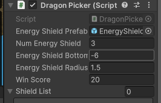

# АНАЛИЗ ДАННЫХ И ИСКУССТВЕННЫЙ ИНТЕЛЛЕКТ [in GameDev]

Отчет по лабораторной работе #3 выполнил:

- Зефиров Никита Викторович
- РИ-220946

Отметка о выполнении заданий:

|Задание|Выполнение|Баллы|
|---|---|---|
|Задание 1|*|60|
|Задание 2|*|20|
|Задание 3|*|20|

знак "*" - задание выполнено; знак "#" - задание не выполнено;

Работу проверили:

- к.т.н., доцент Денисов Д.В.
- к.э.н., доцент Панов М.А.
- ст. преп., Фадеев В.О.

[](https://nodesource.com/products/nsolid)

[](https://travis-ci.org/joemccann/dillinger)

Структура отчета

- Данные о работе: название работы, фио, группа, выполненные задания.
- Цель работы.
- Задание 1.
- Код реализации выполнения задания. Визуализация результатов выполнения (если применимо).
- Задание 2.
- Код реализации выполнения задания. Визуализация результатов выполнения (если применимо).
- Задание 3.
- Код реализации выполнения задания. Визуализация результатов выполнения (если применимо).
- Выводы.
- ✨Magic ✨

## Цель работы

**Разработать оптимальный баланс для десяти уровней игры Dragon Picker**

## Задание 1

### **Предложите вариант изменения найденных переменных для 10 уровней в игре. Визуализируйте изменение уровня сложности в таблице.**

Были выявлены следующие переменные влияющие на уровень сложности:
- *Скорость дракона*  (`Speed`)- определяет скорость перемещения дракона (Лево-Право)
- *Дистанция перемещения*  (`Distance`)- определяет пороговые значения позиции дракона.
- *Шанс смены направления*  (`DCR`)- определяет вероятность изменения направления движения дракона.
- *Задержка сброса яиц*  (`CoolDown`)- определяет временной интервал между запуском каждого яйца.
- *Победный счет* (`WinScore`) - так же ввиду специфики задания была добавлена механика завершения уровня. Уровень завершается при достижении X пойманных яиц и осуществляется переход на следующую сцену.

Вариант изменения сложности:
- `Speed += 5%`
- `CoolDown -= 5%`
- `DCR  += 0.001`
- `Distance += 1`
- `WinScore += 3`

> Общий уровень сложности (`Total difficult`) определяется как сумма значений переменных умноженных на соответствующие коэффициенты.

## Задание 2

### **Создайте 10 сцен на Unity с изменяющимся уровнем сложности.**

Были созданы 10 сцен на Unity с соответствующими настройками сложности.


Cкрипты `EnergyShield.cs` и `DragonPicker.cs` были дополнен реализаций перехода на следующую сцену по достижении заданного значения `WinScore`.

Код измененного `EnergyShield.cs`:
```C#
public int winScore = 5;

private void OnCollisionEnter(Collision coll)  
{  
    var Collided = coll.gameObject;  
    if (Collided.CompareTag("Dragon Egg"))  
    {        Destroy(Collided);  
    }  
    var score = int.Parse(scoreGT.text);  
    score += 1;  
    if (score == winScore)  
    {        SceneManager.LoadScene(SceneManager.GetActiveScene().buildIndex + 1);  
    }    else  
    {  
        scoreGT.text = score.ToString();  
        audioSource = GetComponent<AudioSource>();  
        audioSource.Play();  
    }}
```


Код измененного `DragonPicker.cs`:
```C#  
public int winScore = 5;

private void Start()  
{  
    shieldList = new List<GameObject>();  
  
    for (var i = 1; i <= numEnergyShield; i++)  
    {        var tShieldGo = Instantiate(energyShieldPrefab);  
        var es = tShieldGo.GetComponent<EnergyShield>();  
        es.winScore = winScore;  
        tShieldGo.transform.position = new Vector3(0, energyShieldBottomY, 0);  
        tShieldGo.transform.localScale = new Vector3(1 * i, 1 * i, 1 * i);  
        shieldList.Add(tShieldGo);  
    }}
```

> Показаны только методы которые были дополнены/изменены.


Параметры скриптов в соответствии со сгенерированными значениями из таблицы:





## Задание 3

### Заполнение Google-таблицы с помощью скрипта на Python

Скрипт для заполнения Google таблиц:
```python
import gspread  
  
gc = gspread.service_account(filename='$RY98KLP.json')  
sh = gc.open("Workshop_2")  
  
cof_speed = 2.0  
cof_cooldown = 2.0  
cof_dcr = 1.5  
cof_distance = .5  
cof_win_score = 2.0  
  
  
def write_title() -> None:  
    sh.sheet1.update('A1', 'Level')  
    sh.sheet1.update('B1', 'Dragon speed')  
    sh.sheet1.update('C1', 'CoolDown')  
    sh.sheet1.update('D1', 'Dir change rate')  
    sh.sheet1.update('E1', 'Distance X')  
    sh.sheet1.update('F1', 'Win score')  
    sh.sheet1.update('G1', 'Total difficult')  
  
  
def write_data(case: int, ds: float, cd: float, dcr: float, d: float, score: int, total: float) -> None:  
    sh.sheet1.update(f'A{str(case + 1)}', str(case))  
    sh.sheet1.update(f'B{str(case + 1)}', str(ds))  
    sh.sheet1.update(f'C{str(case + 1)}', str(cd))  
    sh.sheet1.update(f'D{str(case + 1)}', str(dcr))  
    sh.sheet1.update(f'E{str(case + 1)}', str(d))  
    sh.sheet1.update(f'F{str(case + 1)}', str(score))  
    sh.sheet1.update(f'G{str(case + 1)}', str(total))  
  
  
def find_total(ds: float, cd: float, rate: float, d: float, score: int) -> float:  
    return (  
            (ds * cof_speed) +  
            (cd * cof_cooldown) +  
            (rate * cof_dcr) +  
            (score * cof_win_score) +  
            (d * cof_distance)  
    )  
  
  
write_title()  
  
speed = 4.0  
cooldown = 2.0  
dcr = 0.01  
distance = 10.0  
win_score = 5  
total_diff = find_total(speed, cooldown, dcr, distance, win_score)  
  
for i in range(1, 11):  
    write_data(i, speed, cooldown, dcr, distance, win_score, total_diff)  
    speed = round((speed + (speed * .05)), 4)  
    cooldown = round((cooldown - (cooldown * .05)), 4)  
    dcr = round(dcr + 0.001, 4)  
    distance = round(distance + 1, 2)  
    win_score += 3  
    total_diff = round(find_total(speed, cooldown, dcr, distance, win_score), 2)
```


Скрипт для создания графиков изменения сложности:
```python
import gspread  
import pandas as pd  
import matplotlib.pyplot as plt  
  
gc = gspread.service_account(filename='$RY98KLP.json')  
sh = gc.open("Workshop_2")  
worksheet = sh.sheet1  
data = worksheet.get_all_values()  
df = pd.DataFrame(data[1:], columns=data[0])  
  
  
def build_plot(data_frame, t: str):  
    plt.figure(figsize=(10, 6))  
    plt.bar(data_frame['Level'], data_frame[t])  
    plt.xlabel('Level')  
    plt.ylabel('Value')  
    plt.grid(True)  
    plt.title(t)  
    plt.savefig(f'WS_3_Plot_{t.replace(' ', '_')}.png')  
  
  
build_plot(df, 'Dragon speed')  
build_plot(df, 'CoolDown')  
build_plot(df, 'Dir change rate')  
build_plot(df, 'Distance X')  
build_plot(df, 'Win score')  
build_plot(df, 'Total difficult')
```


## Выводы

- В процессе выполнения лабораторной работы было изучено поведение объекта `Enemy` и `механика зачета очков` в игре *Dragon Picker*,  были выявлены переменные, влияющие на уровень сложности игры. 
- На основе анализа была создана и заполнена Google таблица с помощью Python-скрипта.
- Были рассчитаны значения для полей таблицы определяющие возрастающую сложность.  
- Были созданы 10 сцен в Unity.
- Были изменены значения соответствующих переменных на сценах, что является реализацией возрастающей сложности.

|Plugin|README|
|---|---|
|Dropbox|[plugins/dropbox/README.md][PlDb]|
|GitHub|[plugins/github/README.md][PlGh]|
|Google Drive|[plugins/googledrive/README.md][PlGd]|
|OneDrive|[plugins/onedrive/README.md][PlOd]|
|Medium|[plugins/medium/README.md][PlMe]|
|Google Analytics|[plugins/googleanalytics/README.md][PlGa]|

## [](https://github.com/Den1sovDm1triy/DA-in-GameDev-lab1/blob/main/README.md#powered-by)Powered by

**BigDigital Team: Denisov | Fadeev | Panov**
