# АНАЛИЗ ДАННЫХ И ИСКУССТВЕННЫЙ ИНТЕЛЛЕКТ [in GameDev]

Отчет по лабораторной работе #4 выполнил:

- Зефиров Никита Викторович
- РИ-220946

Отметка о выполнении заданий:

|Задание|Выполнение|Баллы|
|---|---|---|
|Задание 1|*|60|
|Задание 2|*|20|
|Задание 3|*|20|

знак "*" - задание выполнено; знак "#" - задание не выполнено;

Работу проверили:

- к.т.н., доцент Денисов Д.В.
- к.э.н., доцент Панов М.А.
- ст. преп., Фадеев В.О.

[](https://nodesource.com/products/nsolid)

[](https://travis-ci.org/joemccann/dillinger)

Структура отчета

- Данные о работе: название работы, фио, группа, выполненные задания.
- Цель работы.
- Задание 1.
- Код реализации выполнения задания. Визуализация результатов выполнения (если применимо).
- Задание 2.
- Код реализации выполнения задания. Визуализация результатов выполнения (если применимо).
- Задание 3.
- Код реализации выполнения задания. Визуализация результатов выполнения (если применимо).
- Выводы.
- ✨Magic ✨

## Цель работы

**Подключить модель `Perceptron` к Unity GameObject**

## Задание 1

### **Реализовать на Unity перцептрон.**

- Был взят предоставленный скрипт перцептрона `Perceptron.cs`. 
- Были созданы 4 куба реализующих скрипт `Perceptron.cs`.
- В инспекторе Unity были заданы данные для обучения перцептрона.

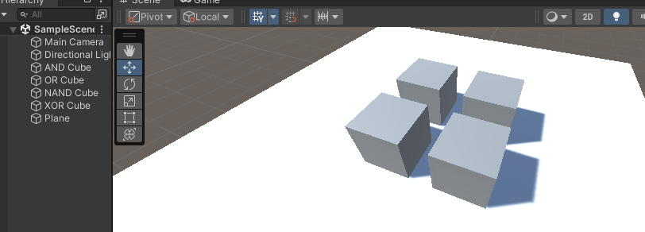

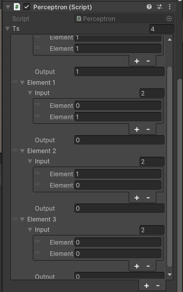
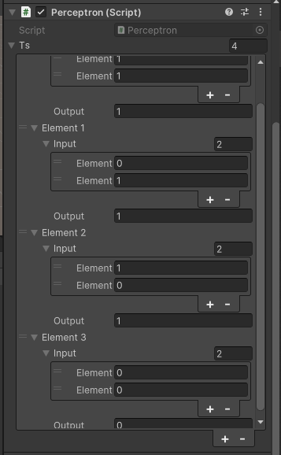
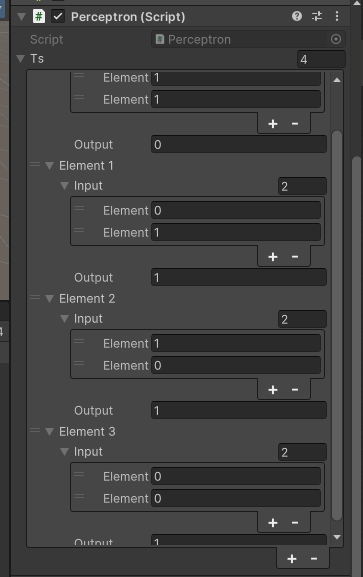
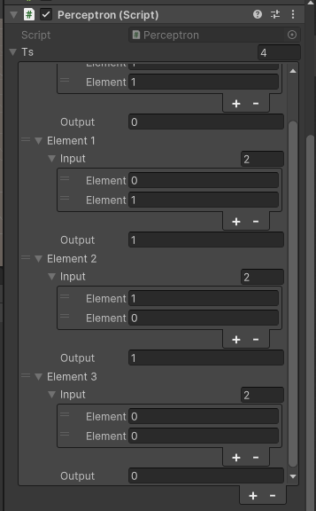

В результате запуска сцены скрипты отработали и выдали ответ в консоль.
> Для наглядности скрипт был дополнен полем name, которое было использовано для распознавания объекта в debug консоли.

Дополненный метод `Start`:
```C#
public new string name = "default"; 

void Start()  
{  
    Train(8);  
    Debug.Log("Test " + name + " 0 0: " + CalcOutput(0, 0));  
    Debug.Log("Test " + name + " 0 1: " + CalcOutput(0, 1));  
    Debug.Log("Test " + name + " 1 0: " + CalcOutput(1, 0));  
    Debug.Log("Test " + name + " 1 1: " + CalcOutput(1, 1));  
}
```

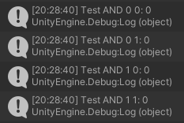
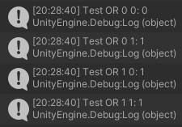
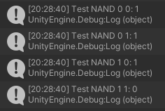
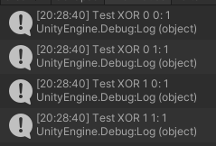

- `AND` - работает корректно.
- `NAND` - работает корректно.
- `OR` - работает корректно.
- `XOR` - не обучается по причине того, что оба пороговых значения (0, 0 и 1, 1) должны давать одинаковый результат, это классическая ***XOR Problem*** .

## Задание 2

### **Построить графики зависимости количества эпох от ошибки  обучения.**

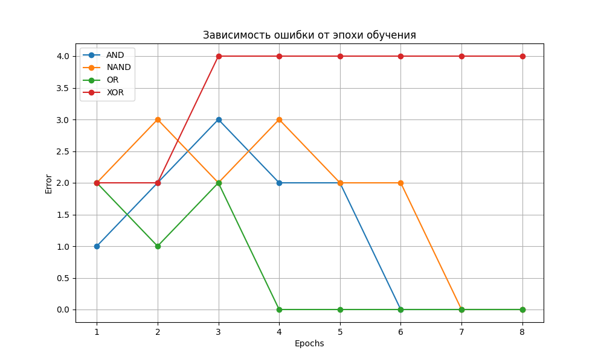

Для построения графика средствами C# значения ошибок были записаны в файлы `AND.txt`, `NAND.txt`, `OR.txt` и `XOR.txt`.

Код записи данных в файлы (показан только код относящийся к записи):
```C#
private List<double> _errors = new();

void Train(int epochs)  
{  
    InitialiseWeights();  
    for (int e = 0; e < epochs; e++)  
    {        totalError = 0;  
        for (int t = 0; t < ts.Length; t++)  
        {            UpdateWeights(t);  
        }        _errors.Add(totalError);  
    }
}
void Start()  
{  
    Train(8);  
    var filePath = Path.Combine(Application.persistentDataPath, name + ".txt");  
    try  
    {  
        using (var writer = new StreamWriter(filePath))  
            for (var i = 0; i < _errors.Count; i++)  
            {                writer.WriteLine((i + 1) + " " + _errors[i]);  
            }        Debug.Log("Path: " + filePath);  
    }    catch (Exception e)  
    {        Debug.LogWarning("WritingError: " + e.Message);  
    }
}
```

Поле чего при помощи  `python` и `matplotlib` был создан график.

Код python-скрипта:
```python
import matplotlib.pyplot as plt  
  
  
def read_and_parse(filename):  
    first_numbers = []  
    second_numbers = []  
  
    with open(filename, 'r') as file:  
        lines = file.readlines()  
        for line in lines:  
            parts = line.split()  
            if len(parts) >= 2:  
                first_numbers.append(int(parts[0]))  
                second_numbers.append(int(parts[1]))  
  
    return first_numbers, second_numbers  
  
  
epo_and, error_and = read_and_parse("AND.txt")  
epo_nand, error_nand = read_and_parse("NAND.txt")  
epo_or, error_or = read_and_parse("OR.txt")  
epo_xor, error_xor = read_and_parse("XOR.txt")  
  
plt.figure(figsize=(10, 6))  
plt.plot(epo_and, error_and, marker='o', label='AND')  
plt.plot(epo_and, error_nand, marker='o', label='NAND')  
plt.plot(epo_and, error_or, marker='o', label='OR')  
plt.plot(epo_and, error_xor, marker='o', label='XOR')  
plt.xlabel('Epochs')  
plt.ylabel('Error')  
plt.title('Зависимость ошибки от эпохи обучения')  
plt.legend()  
plt.grid(True)  
  
plt.savefig('WS_4_Plot_ERROR.png')
```

### Необходимое кол-во эпох зависит от:
- **Сложность задачи**: Более сложные задачи могут потребовать большего числа эпох для обучения перцептрона.
- **Размер и качество обучающего набора**: Если обучающий набор содержит большое количество данных или если данные недостаточно репрезентативны, то обучение может требовать большего числа эпох.
- **Выбор архитектуры сети**: Архитектура сети влияет на количество эпох обучения.
- **Используемый алгоритм обучения**: Различные алгоритмы обучения (например, градиентный спуск, стохастический градиентный спуск, адаптивные методы оптимизации) влияют на количество эпох, необходимых для достижения оптимальных весов и сходимости модели.
5. **Предварительная обработка данных**: Предварительная обработка данных, а именно нормализация, очистка, масштабирование, также влияет на эффективность обучения и на количество эпох.
6. **Начальные значения весов и биаса**: Начальные значения параметров модели могут влиять на скорость сходимости и количество эпох, необходимых для достижения оптимальных весов.

## Задание 3

### **Построить визуальную модель работы перцептрона на сцене Unity.**

Для построения визуальной модели в Unity были созданы 4 сцены. Каждая сцена содержит 4 куба со скриптом `Perceptron.cs`. Над каждым кубом расположены два меньших куба имеющих скрипт `BoolState.cs`. 

Скрипт `BoolState.cs`:
```C#
public class BoolState : MonoBehaviour  
{  
    public bool state;  
}
```

Над каждым кубом-перцептроном два куба-значения имеют различное состояние, соответствующее возможным входным данным (0,0; 0,1; 1,0; 1, 1) 

Для визуального отображения значения были созданы 3 материала:
- Красный - `False` (0)
- Зеленый - `True` (1)
- Серый - `unknown`, не `True` и не `False`, т.е. состояние при котором значение не определено.

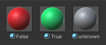

Каждая сцена имеет вид:

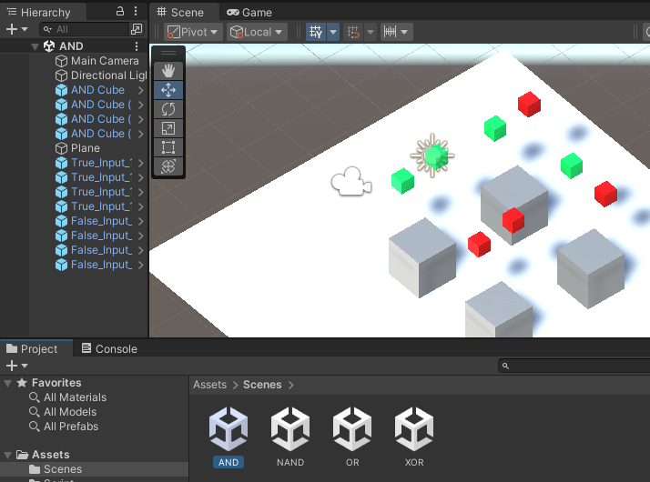

При запуске каждой сцены кубы-значения падают на кубом-перцептрон, в зависимости от ответа перцептрона у него меняется материал.

На каждой сцене расположены по 4 куба-перцептрона обученные на одинаковом наборе данных, т.е. каждая сцена показывает все возможные случаи.

Результат запуска сцены `AND`:
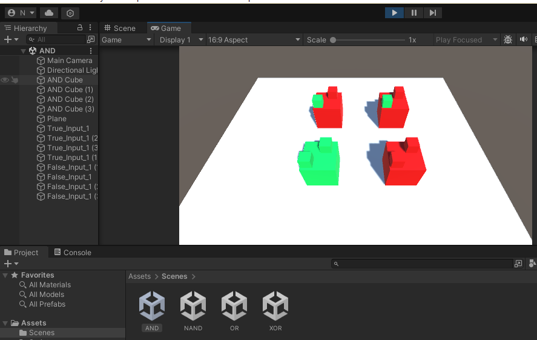

Результат запуска сцены `NAND`:
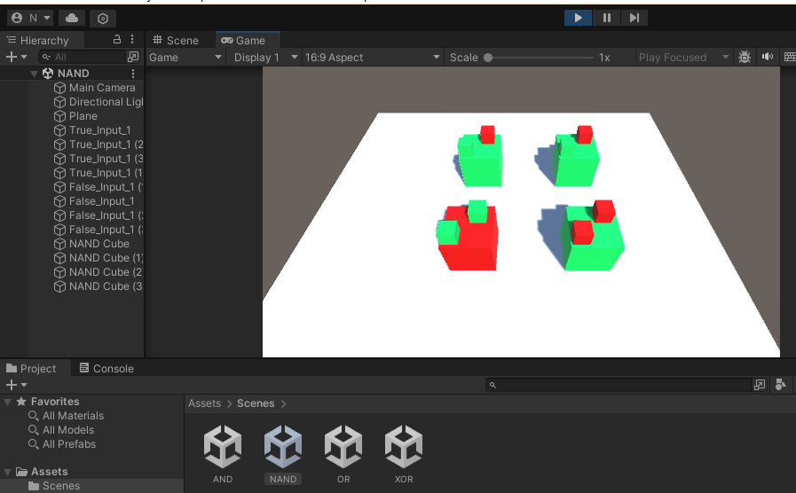

Результат запуска сцены `OR`:
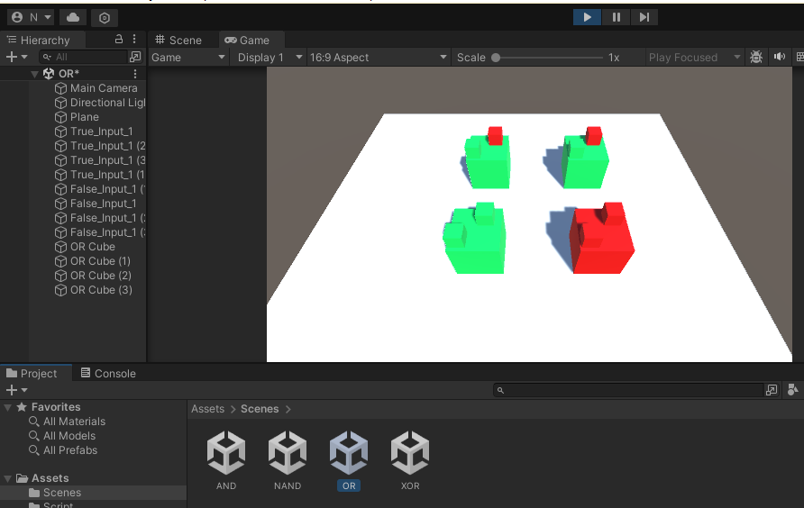

Результат запуска сцены `XOR`:
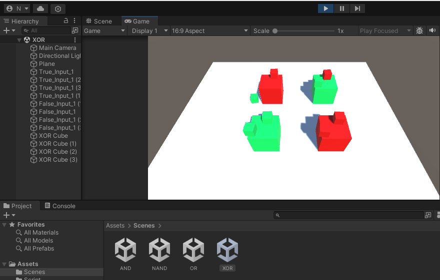

Код `Percepton.cs` (показан только код требуемый для реализации визуализации):
```C#
public Material matTrue;  
public Material matFalse;  
private List<float> _values = new();  
  
private void OnCollisionEnter(Collision other)  
{  
    Debug.Log(other.gameObject);  
    if (other.gameObject.CompareTag("Ground")) return;  
  
    _values.Add(other.gameObject.GetComponent<BoolState>().state ? 1 : 0);  
}  
  
void Update()  
{  
    if (_values.Count != 2) return;  
    var result = CalcOutput(_values[0], _values[1]);  
    var rend = GetComponent<Renderer>();  
    if (rend != null)  
        rend.material = result == 1 ? matTrue : matFalse;  
    else  
        Debug.LogWarning("Renderer or new material is not assigned!");  
    _values.Clear();  
}
```


Так же для плоскости был задан тэг `Gronund`, чтобы отличить коллизию с плоскостью от коллизии с кубами-значениями.

## Выводы

- В ходе работы была на практике применена и интегрирована модель перцептрона в игровой движок *Unity*.
- Создана визуализация.
- Построен график.

Полный код скрипта `Perceptron.cs` на момент окончания работы:
```C#
using System;  
using System.Collections;  
using System.Collections.Generic;  
using System.IO;  
using UnityEngine;  
using Random = UnityEngine.Random;  
  
[System.Serializable]  
public class TrainingSet  
{  
    public double[] input;  
    public double output;  
}  
  
public class Perceptron : MonoBehaviour  
{  
    public new string name = "default";  
    public Material matTrue;  
    public Material matFalse;  
    public TrainingSet[] ts;  
    double[] weights = { 0, 0 };  
    double bias = 0;  
    double totalError = 0;  
  
    double DotProductBias(double[] v1, double[] v2)  
    {        if (v1 == null || v2 == null)  
            return -1;  
  
        if (v1.Length != v2.Length)  
            return -1;  
  
        double d = 0;  
        for (int x = 0; x < v1.Length; x++)  
        {            d += v1[x] * v2[x];        }  
        d += bias;  
  
        return d;  
    }  
    double CalcOutput(int i)  
    {        double dp = DotProductBias(weights, ts[i].input);  
        if (dp > 0) return (1);  
        return (0);  
    }  
    void InitialiseWeights()  
    {        for (int i = 0; i < weights.Length; i++)  
        {            weights[i] = Random.Range(-1.0f, 1.0f);  
        }  
        bias = Random.Range(-1.0f, 1.0f);  
    }  
    void UpdateWeights(int j)  
    {        double error = ts[j].output - CalcOutput(j);  
        totalError += Mathf.Abs((float)error);  
        for (int i = 0; i < weights.Length; i++)  
        {            weights[i] = weights[i] + error * ts[j].input[i];  
        }  
        bias += error;  
    }  
    double CalcOutput(double i1, double i2)  
    {        double[] inp = new double[] { i1, i2 };  
        double dp = DotProductBias(weights, inp);  
        if (dp > 0) return (1);  
        return (0);  
    }  
    private List<double> _errors = new();  
  
    void Train(int epochs)  
    {        InitialiseWeights();  
  
        for (int e = 0; e < epochs; e++)  
        {            totalError = 0;  
            for (int t = 0; t < ts.Length; t++)  
            {                UpdateWeights(t);  
            }            _errors.Add(totalError);  
        }    }  
    void Start()  
    {        Train(8);  
        var filePath = Path.Combine(Application.persistentDataPath, name + ".txt");  
        try  
        {  
            using (var writer = new StreamWriter(filePath))  
                for (var i = 0; i < _errors.Count; i++)  
                {                    writer.WriteLine((i + 1) + " " + _errors[i]);  
                }            Debug.Log("Path: " + filePath);  
        }        catch (Exception e)  
        {            Debug.LogWarning("WritingError: " + e.Message);  
        }    }  
    public Material matTrue;  
    public Material matFalse;  
    private List<float> _values = new();  
  
    private void OnCollisionEnter(Collision other)  
    {        Debug.Log(other.gameObject);  
        if (other.gameObject.CompareTag("Ground")) return;  
  
        _values.Add(other.gameObject.GetComponent<BoolState>().state ? 1 : 0);  
    }  
    void Update()  
    {        if (_values.Count != 2) return;  
        var result = CalcOutput(_values[0], _values[1]);  
        var rend = GetComponent<Renderer>();  
        if (rend != null)  
            rend.material = result == 1 ? matTrue : matFalse;  
        else  
            Debug.LogWarning("Renderer or new material is not assigned!");  
        _values.Clear();  
    }}
```

|Plugin|README|
|---|---|
|Dropbox|[plugins/dropbox/README.md][PlDb]|
|GitHub|[plugins/github/README.md][PlGh]|
|Google Drive|[plugins/googledrive/README.md][PlGd]|
|OneDrive|[plugins/onedrive/README.md][PlOd]|
|Medium|[plugins/medium/README.md][PlMe]|
|Google Analytics|[plugins/googleanalytics/README.md][PlGa]|

## [](https://github.com/Den1sovDm1triy/DA-in-GameDev-lab1/blob/main/README.md#powered-by)Powered by

**BigDigital Team: Denisov | Fadeev | Panov**
